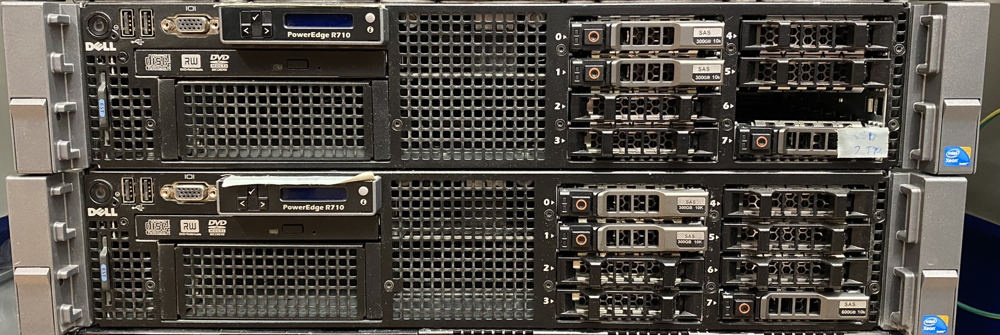
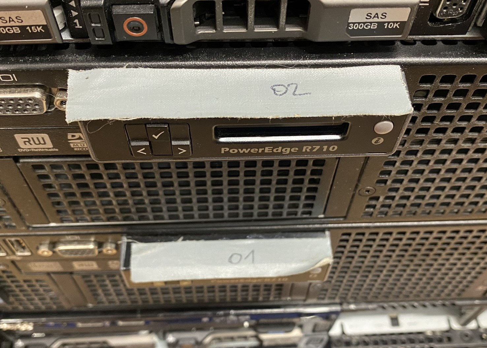
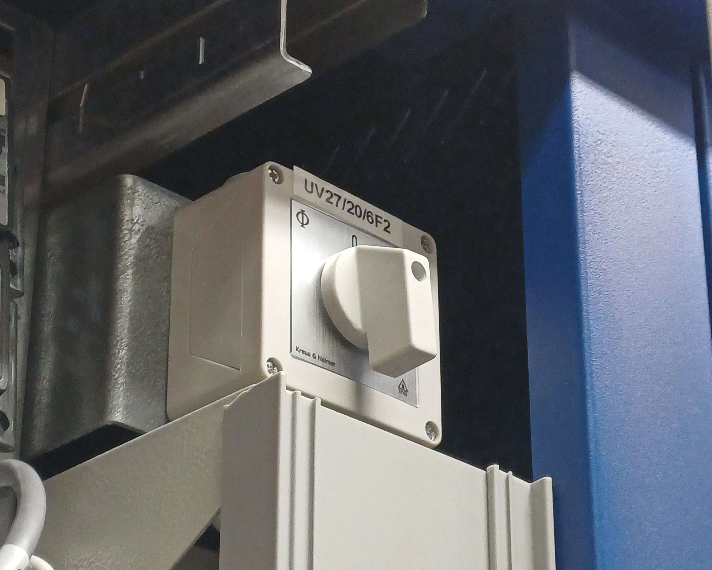
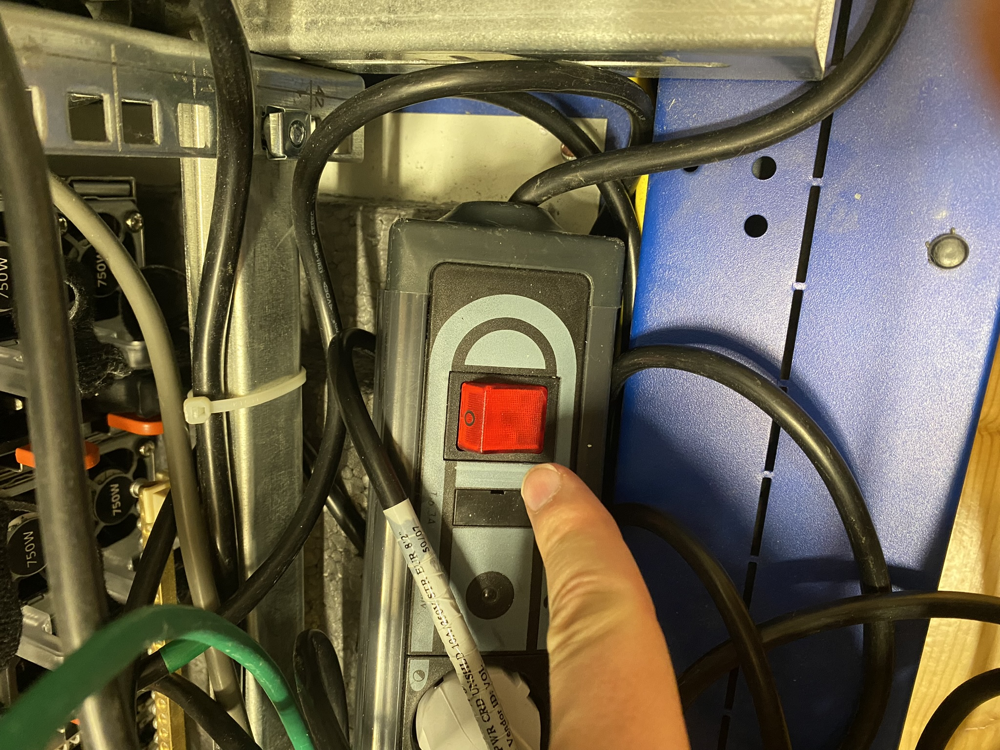
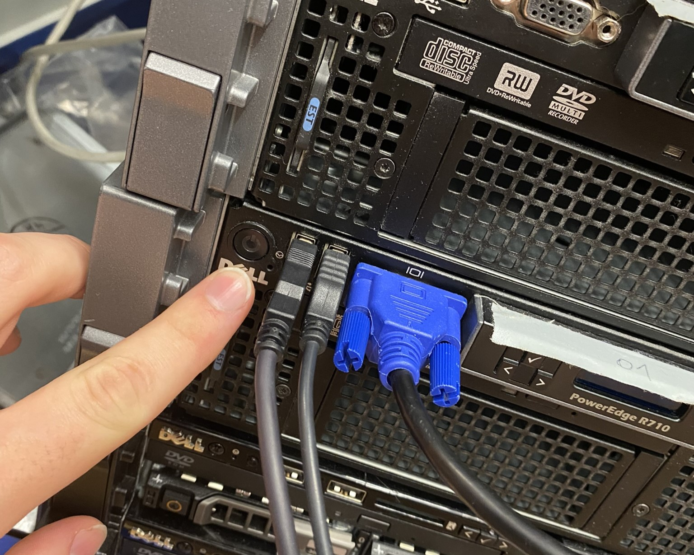
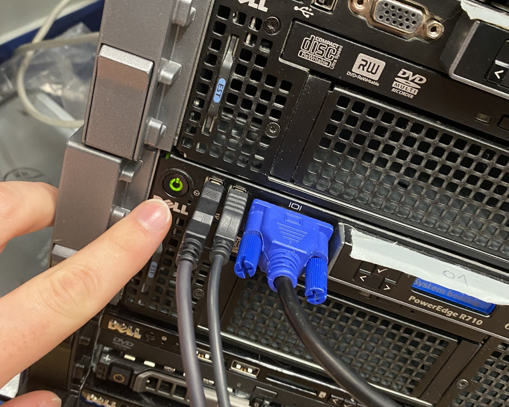

# Serverhandling Anleitung

## Allgemeine Informationen

### Die Server

### HV-O1

- CPU: Intel Xeon 8-Core E5640@2.67Ghz
  - L1-Cache: 512KB
  - L2-Cache: 2MB
  - L3-Cache: 24MB

- RAM: 120GB DIMM-DDR3@1333MHz

- Speicherplatz
  - 

### HV-O2

- CPU: Intel Xeon 8-Core E5640@2.67Ghz
  - L1-Cache: 512KB
  - L2-Cache: 2MB
  - L3-Cache: 24MB

- RAM: 144GB DIMM-DDR3@1333MHz

- Speicherplatz
  - 

## Erste Schritte

- Einschalten der Server
  - Hauptschalter einschalten (1 = EIN | 0 = AUS)
   
  
   

  - Hinter den Serverschrank begeben
   
  
   

  - Den Tischverteiler anschalten
   
  
   

  - Anschaltknopf betätigen
   
  
  
   
  - Best Practices
    - Zuerst HV01 hochfahren, da HV02 auf diesen Server wartet
    - Beim Herunterfahren zuerst HV02 herunterfahren, da dieser Server von HV01 abhängig ist.

