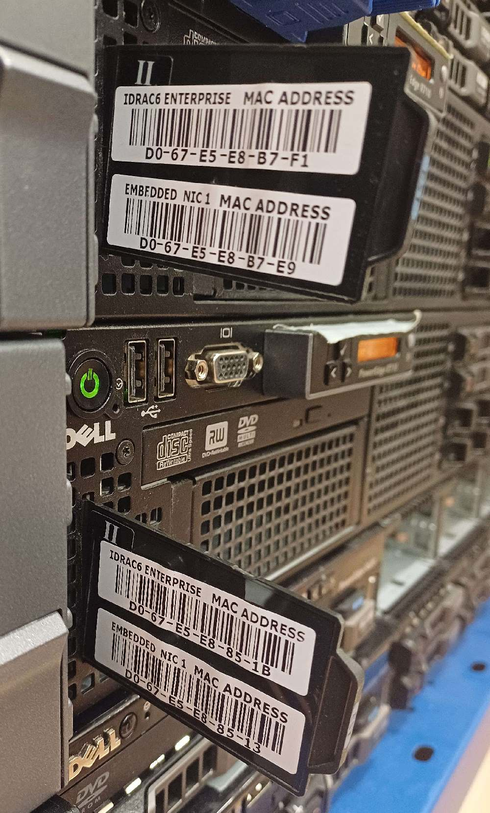
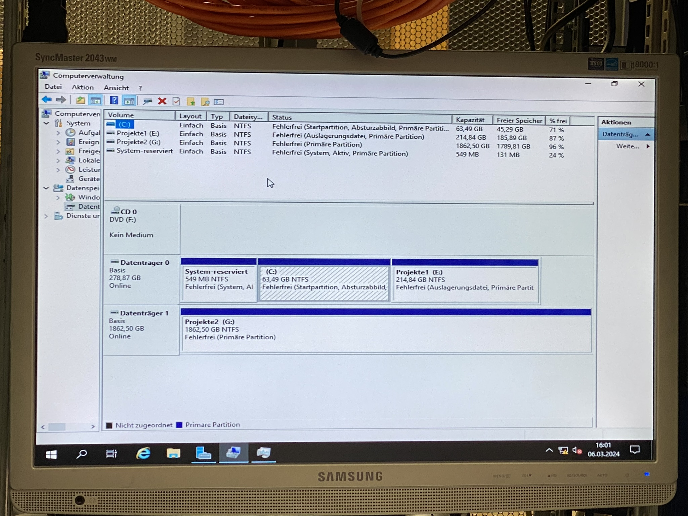

# Serverhandling Anleitung

## Allgemeine Informationen

### Die Server

* oben HV02, unten HV01.  

* Domäne: ``copr-gmbh.lab``

* Servertags  

* MAC-Karten  

* Hyper-V Manager   

---

### HV-O1

- CPU: Intel Xeon 8-Core E5640@2.67Ghz
  - L1-Cache: 512KB
  - L2-Cache: 2MB
  - L3-Cache: 24MB

- RAM: 120GB DIMM-DDR3@1333MHz

- Festplatten  

- Speicherplatz  
  ...

- Partitionen  
  ...

- Netzwerkverbindungen  

- Virtuelle Switches

- Servermanager  

---

### HV-O2

- CPU: Intel Xeon 8-Core E5640@2.67Ghz
  - L1-Cache: 512KB
  - L2-Cache: 2MB
  - L3-Cache: 24MB

- RAM: 144GB DIMM-DDR3@1333MHz

- Festplatten  

- Speicherplatz  

- Partitionen  

- Netzwerkverbindungen

- Virtuelle Switches

- Servermanager  

## Erste Schritte

- Einschalten der Server
  - ***Anfangen mit HV-01!*** Zuerst diesen Hochfahren, da HV-02 auf ihn abhängig ist.
  - Hauptschalter einschalten (1 = EIN | 0 = AUS)  
  

  - Hinter den Serverschrank begeben  
  

  - Den Tischverteiler anschalten  
  

  - Anschaltknopf betätigen (zuerst HV01)  
  
  
  - die drei Kabel (VGA für Video, 2 USBs für Tastatur und Maus) anschließen
  
  - Warten, bis HV01 vollständig gebootet wurde (Windows Login Fenster)

  - den selben Prozess mit HV02 durchmachen

## Herunterfahren
  - Umgekehrte Reihenfolge als beim Hochfahren
  - ***Zuerst HV02 herunterfahren***, da dieser Server von HV01 abhängig ist.
  - Normaler Windows-Logout unten links. Es werden alle Prozesse gestoppt, dann wird Server heruntergefahren.
  
  - Roten Schalter (Tischverteiler) hinten ausmachen
  - Hauptschalter abdrehen (?)
